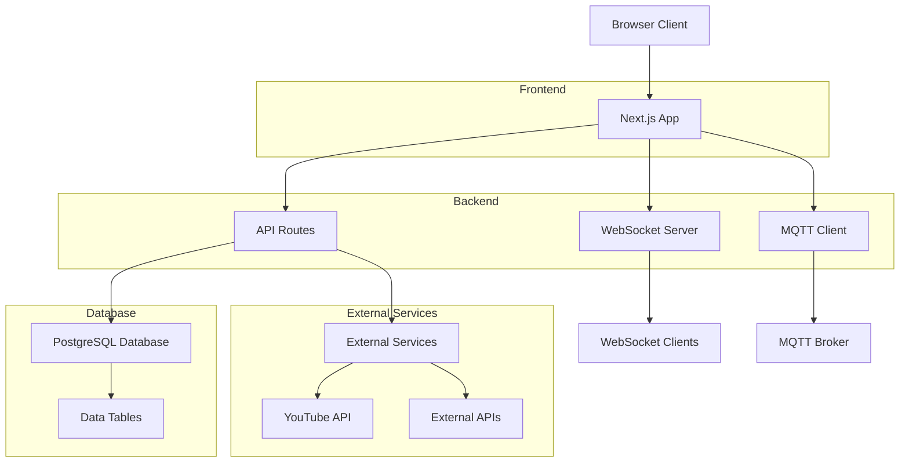
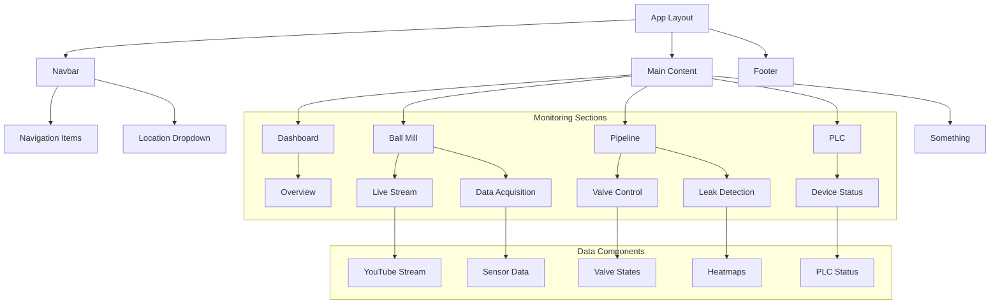
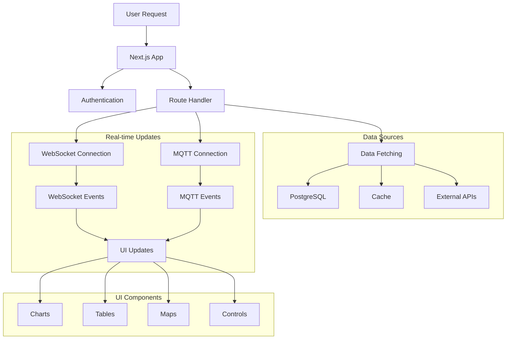
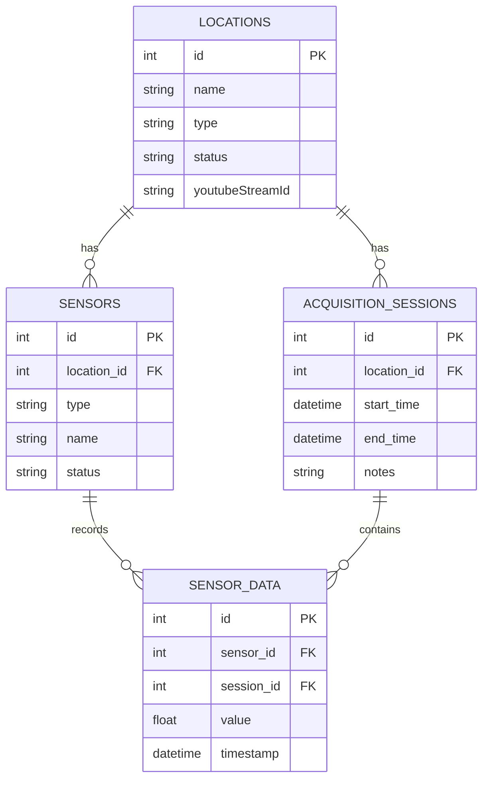
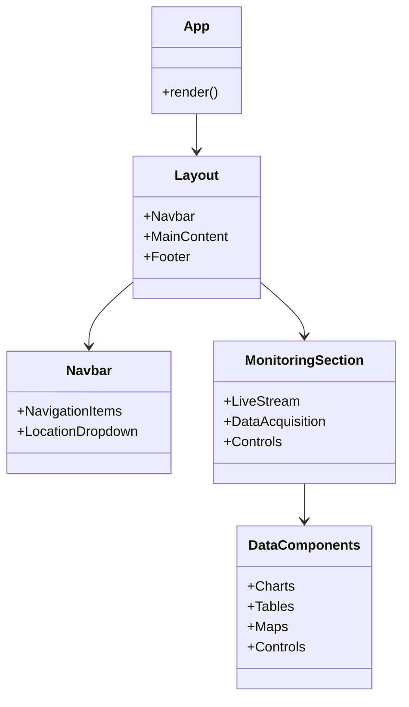
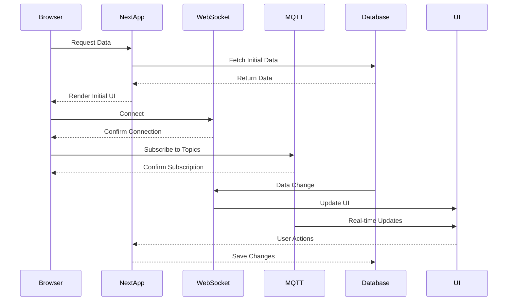
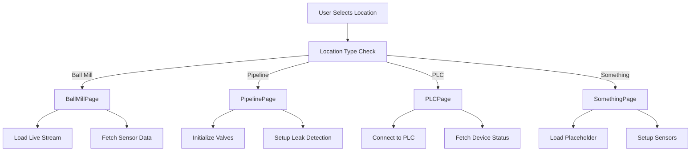
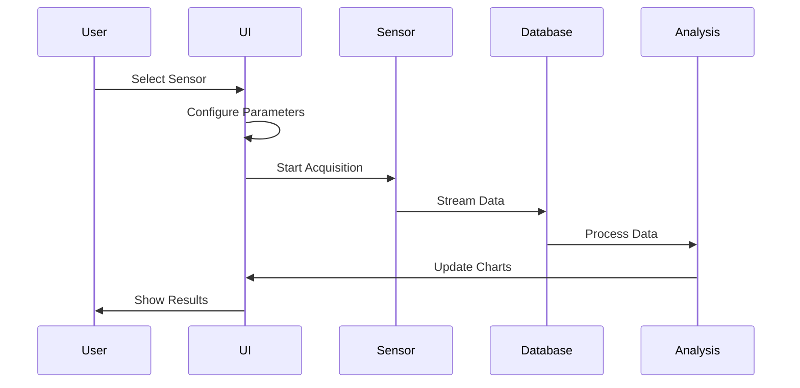

# Ball Mill Monitoring System Architecture Diagrams

## 1. High-Level System Architecture

## 2. Component Architecture

## 3. Data Flow Diagram

## 4. Database Schema

## 5. Component Hierarchy

## 6. Real-time Communication Flow

## 7. Location-Based Monitoring Flow

## 8. Data Acquisition Flow

## Legend
- Solid lines: Direct connections
- Dashed lines: Event-driven connections
- Arrowheads: Data flow direction
- Boxes: Components/Services
- Rounded boxes: Processes
- Diamonds: Decision points
- Clouds: External services
- Cylinders: Databases
